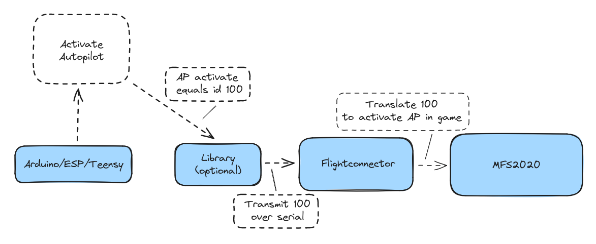
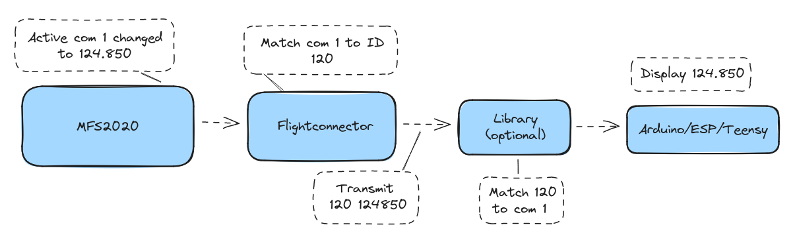

## Introduction

These are the docs for the Flightconnector.

### Supported simulators

- Microsoft Flight Simulator 2020
- (will work on compatibility ASAP) Microsoft Flight Simulator 2024

### How does the connector work

The connector uses Serial communication to communicate with your peripherals. It listens for data transmitted by your devices (we call them inputs) and at the same time it can send data to your devices (we call these outputs).
ID's are used to match inputs and outputs to the correct simulation variables.

### Input flow

You'll find a list of all available inputs in the [inputs chapter](./ch03-00-inputs.md).

### Output flow

You'll find a list of all available outputs in the [outputs chapter](./ch03-01-outputs.md).

