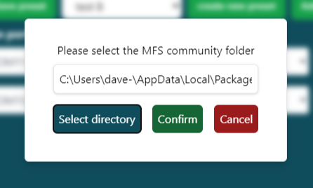

# Installation

## Connector

The connector can be installed using the [latest installer](https://github.com/bitsAndDroids/flightConnector-Rust/releases/latest).
During startup the connector will automatically check for updates on Github. A pop-up will appear if a new version is available.

## WASM

The WASM module unlocks more simulation variables with which to interact. The [WASM chapter](./ch06-00-wasm.md) provides a full explanation.
You're able to install the module by copying the entire wasm_module into the MFS2020 community package folder.

If you want to ensure the module is properly installed, you're able to follow these steps:

- Start MFS2020
- Open the option menu
- Enable developer mode
- Open the debug menu
- Open the console
- Search for BitsAndDroids

If the search results show messages that the module was initialized, the module will be loaded properly.

### Install from the connector

You’re able to install the WASM module using the installer in the connector.

- Click on settings from the menubar
- Select install WASM
- Click on the “select directory” button
- Search for the MFS2020 community folder

- Click “Select folder”
- Click the confirm button

To check if the installation succeeded, you can open the community folder. If the installation succeeded, there should be a folder called BitsAndDroidsModule.
