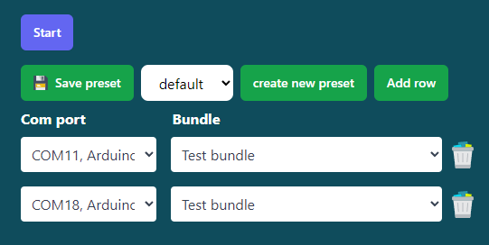

# Presets

Presets are a way to save multiple device configurations for flight simmers that want to match their setup to their needs. This makes it simple to swap your devices when you switch your airliner for a general aviation plane. In short, each preset contains one or multiple bundles (A bundle is a device matched with the outputs it needs to receive) that can be saved as a set.

Your presets can be managed from the home screen. From here, you can create, save, and edit them. Your first preset will be called (what a coincidence) default by default. You’re able to alter this preset to your heart’s desire.

## Create a preset

If you want to create a new preset, press the Create new preset button.
This prompts you to enter a fitting name.
The connector will save the new empty preset to your settings.
It will also be selected as the current active preset.
To ensure you’re using the correct set, you should see the name of your new set in the dropdown menu.
If you hit start for the first time using your new preset, the connector will save the set as the last active preset.
If you start the connector, your last preset will be reinstated.
The connector defaults to the first available device if the device isn't connected.
If this happens, the alternate device won’t be saved to memory unless you manually press the save preset button.

## Edit a preset

You can edit your presets by changing the run configuration by adding and removing rows, changing devices, and altering the bundles.
Remember to save your changes before changing the preset you’ve equipped.

> These changes will automatically be saved when you make changes

## Delete a preset

You're able to remove a preset from the manage preset page.

- Click on settings in the main menu
- Navigate to the Manage presets page
- Click on the trashcan to delete the preset

> You're not able to delete the default preset

## Edit preset name

> This is a placeholder. This functionality isn't finished yet.
