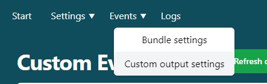

# Custom events

As explained in the [previous chapter](./ch06-00-wasm.md) not all events can be accessed through SimConnect.
Using the WASM module we're able to utilize a whole new set of functionalities.
You're able to send data to MFS or receive data and send it to your microcontroller.
Since there are more third party planes available than my wallet allows me to obtain it's not possible to add events for everyone of them to the connector.
By adding custom events you're able to control event the most obscure aircraft.
These events are formatted using [Reverse Polish Notation](https://docs.flightsimulator.com/html/Additional_Information/Reverse_Polish_Notation.htm).
The connector calls these actions custom commands.
You're able to see and edit the custom commands from the custom events menu under the events menu.

## Events broken down

An event can be broken down in smaller parts.

- ID
- Actions
- Description
- Type
- Category
- Output format
- Update every

### ID

The ID is used to identify the event.
When the event is defined as an input, you can trigger it by sending the ID to the connector.
The connector will then trigger the corresponding action.
When the event is defined as an output the connector will prefix the value with the ID. This makes it possible to identify the received value on your controller.

### Action

The action is the event that will be triggered if the connector receives the corresponding ID or the data that MFS requests.

> [HubHop](https://hubhop.mobiflight.com/presets/) is a website that contains a library of events created by other simmers.

You can add logical/conditional steps into these events to create complex events.
An example of a more complex event is:
`(A:AUTOPILOT ALTITUDE LOCK VAR, feet) - 1000 + (>K:AP_ALT_VAR_SET_ENGLISH) (>H:AP_KNOB_Down)`
This basically involves taking the current AP alt lock variable and subtracting 1000, assigning this value to the AP alt variable, and animating the button press.
A simpler event would be `1 (>H:TRANSPONDER:1, Enum)`, which sets the transponder state to mode 1.

### Description

Actions can become quite complex and challenging to follow.
The description provides a readable description of the event.
When the event is defined as an output, the description is also used as a label for the checkbox in the bundle editor.

### Type

There are two types of events: inputs and outputs.
Inputs are events that are triggered by an incoming message from your controller.
To trigger these events, you need to send the ID to the connector.
Output events define events that the connector continuously requests from the simulator. If the data changes more than the threshold (update every field), the connector sends the value to your controller, which is prefixed by the ID.

### Category

You can add a category to organize your events. This will eventually be used to filter the events table (WIP).
In the future, you can add more categories.

### Output format

If the event is an output, the output format field will appear. This determines in which format the connector needs to return the data.
Available types are:

- Float (1.5)
- Integer (1)
- Time (20:10:10)
- Boolean (true/false or 1/0)
- String (still untested)

### Update every

Update every is only applicable to outputs.
This value dictates at which interval the connector needs to send data.
Let’s say you want to receive the altitude of your aircraft.
The simulator will send every altitude change even if it's just a few inches/millimeters.
In reality, you're probably more interested in the changes per foot.
To achieve this, you could set the update for every value to 1.0.

## Update default events

The custom event menu has a button that says update default events. This button resets the default events or adds them if they were added to the connector after your install date. To prevent overwriting of your changes, this isn’t done automatically. In the future you’ll be able to pick and choose which events to import/reset.

> Resetting the default events only reinstates the original events the connector ships with (or those added later). It won’t affect events you’ve added yourself.
