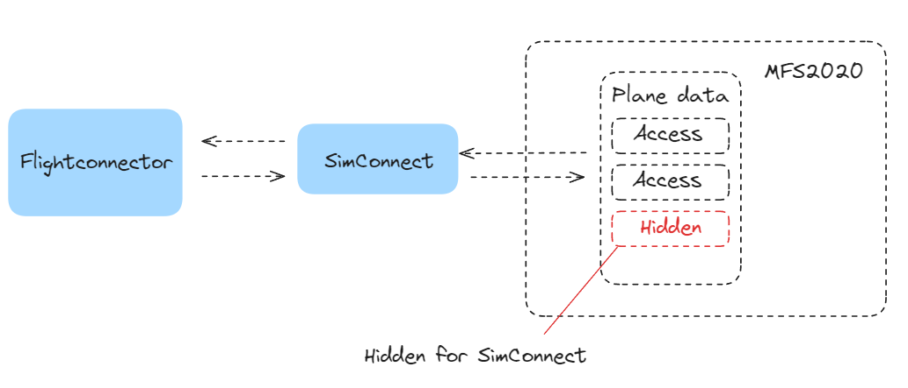
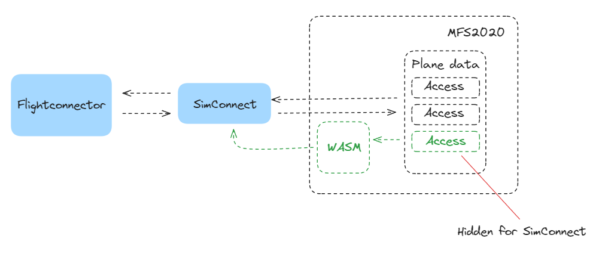

## WASM

Usually, the connector communicates with MFS2020 using SimConnect. SimConnect is an interface that exposes the simulation data to other software. This interface provides an easy way to start consuming the sim data but has some downsides.

One of these downsides is that third-party developers can’t easily add functionality to this interface when they want to implement new features. The result for you as a user is that some interactions are locked in the simulator.

Luckily, there is an answer to this problem! MFS2020 provides functionality that lets an add-on interact with the in-game data. Even the data that isn’t created by the add-on itself. These add-ons are called WASM (web-assembly) modules. These WASM modules live inside the simulator but can talk to the outside world using SimConnect. There are other ways these modules can communicate to the outside world, but since we’re already utilizing SimConnect, this route will be our pick.

The great benefit of this system is that we can add more functionality to this module when necessary. That way we’re able to interact with new aircraft the moment they’re released.

