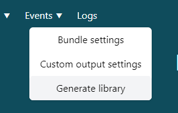
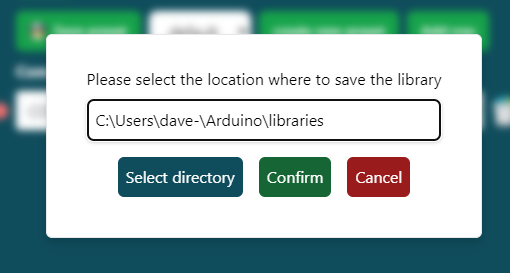

# Library generator

You're able to create your own inputs and outputs in the connector.
To allow this customization the connector comes with a library generator.
The generator will add the outputs you've created to the library.
This way the data will be routed to the correct variables in the library.

> It's recommended to save the library to your Arduino library folder if using the Arduino IDE
> 

## Generated format

The generator will add three components:

- variables
- getters
- switch cases

### variables

The added variables are generated in the format output{id} i.e.: `int output1000;`
The type can be altered by changing the output_format in the event editor.

### getters

The generator adds get functions to make it easy to retrieve the latest value of the event you defined.
This function is designed to retrieve the value in a consistent manner.
A getter might look like this: `int getOutput1000() { return getOutput1000; }`

### switch cases

Last but not least the generator adds switch cases. These look like this: `case 1000: { output1000 = incommingValue; break; }`
These cases will route the incoming values to the correct variables.
