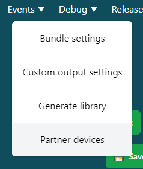
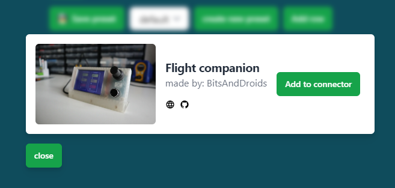
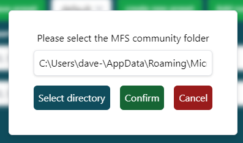

# Welcome to Your Flight Companion

Get ready to enhance your flight simulation experience! The Flight Companion puts essential aircraft controls right at your fingertips. Let's get you up and running in no time.

## Essential Setup Guide

### Step 1: Installing Drivers

Before takeoff, we need to install two crucial pieces of software:

1. First, download and install the [device drivers](https://www.silabs.com/documents/public/software/CP210x_Universal_Windows_Driver.zip) to enable seamless communication between your PC and Flight Companion.

2. Next, install the [Bits and Droids Flight Connector](https://github.com/BitsAndDroids/FlightConnector-Rust/releases/latest) to bridge your Flight Companion with Microsoft Flight Simulator.

> **Quick Install Guide:**
>
> - Download the latest release
> - Run setup.exe to install the connector
> - Future updates will be delivered automatically through the app

### Step 2: Quick Device Setup

We've made setting up your Flight Companion as straightforward as possible:

1. Open the Flight Connector and navigate to `Events -> Partner Devices` in the top navbar
2. Click the "Add Partner Device" button in the window that appears
3. Select your Flight Companion to import all required settings automatically

### Step 3: Initial Configuration

Let's configure your Flight Companion for its first flight:

1. On the connection page, locate the device dropdown on the left
2. Select your device (it will show as "Silicon Labs CP210x...")
3. In the right dropdown, choose "Flight Companion bundle"

### Step 4: Unlocking Full Potential

To access advanced features like PFD controls, you'll need to install a quick plugin:

1. Navigate to `Settings -> Install WASM` in the top navbar
2. When prompted, locate your community folder:

> **Community Folder Locations:**
>
> **Steam Edition:** > `C:\Users\{USERNAME}\AppData\Roaming\Microsoft Flight Simulator\Packages\Community`
>
> **Microsoft Store Edition:** > `C:\Users\{USERNAME}\AppData\Local\Packages\Microsoft.FlightSimulator_8wekyb3d8bbwe\LocalCache\Packages\Community`
>
> **MFS 2024:** > `%appdata%\Microsoft Flight Simulator 2024`

### Step 5: Streamlining Your Experience

Want the connector to launch automatically with your simulator? Here's how:

1. Go to `Settings -> Connection Settings`
2. Enable "Launch when sim starts"
3. You're all set for automatic startup!

## Control Modes Guide

Your Flight Companion features four versatile modes, each activated by rotating the lower encoder. Here's what you can do in each mode:

### Radio Mode

Master your communications with these controls:

| Control             | Function          | Description                         |
| ------------------- | ----------------- | ----------------------------------- |
| Upper Outer Encoder | Khz Frequency     | Fine-tune your radio frequency      |
| Upper Inner Encoder | Mhz Frequency     | Make major frequency adjustments    |
| Upper Encoder Push  | Swap Frequencies  | Quick switch between active/standby |
| Lower Encoder Push  | Cycle Radio Modes | Switch between COM1/COM2/NAV1/NAV2  |
| Touchscreen         | ATC Communication | Use buttons 0-9 for ATC responses   |

### Autopilot Mode

Take command of your autopilot systems:

| Control             | Function         | Description                     |
| ------------------- | ---------------- | ------------------------------- |
| Upper Outer Encoder | Select AP Target | Choose between ALT/HDG/VS       |
| Upper Inner Encoder | Adjust Values    | Fine-tune your selected setting |
| Upper Encoder Push  | Enable Mode      | Activate your chosen AP mode    |
| Touchscreen         | Master Switch    | Toggle AP on/off                |

### PFD Controls

Access advanced flight deck functions:

| Control             | Function           | Description                                                                    |
| ------------------- | ------------------ | ------------------------------------------------------------------------------ |
| Upper Outer Encoder | Menu Navigation    | Browse through open windows                                                    |
| Upper Inner Encoder | Value Adjustment   | Modify selected parameters                                                     |
| Upper Encoder Push  | Mode Selection     | Choose between ALT/HDG/VS                                                      |
| Touchscreen         | Multiple Functions | Access menu, flight plan, zoom, procedures, directories, and PFD softkeys 1-12 |

> **Pro Tip:** Practice switching between modes in a parked position until the controls feel natural. This will help you build muscle memory for in-flight operations.
