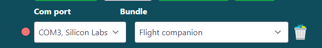

# Flight Companion

## Drivers

In order to use this device you need to install two pieces of software.
Firstly make sure to install the [device drivers](https://www.silabs.com/documents/public/software/CP210x_Universal_Windows_Driver.zip).
This ensures your pc can recognize and communicate with your Flight Companion.

In order to connect your Flight Companion to Microsoft Flight Simulator you need to install the [Bits and Droids Flight Connector](https://github.com/BitsAndDroids/FlightConnector-Rust/releases/latest).

> The latest release can be retrieved using the link above.
> Use the setup.exe to install the connector.
> Updates are being pushed through the app after installation.

This software interprets the events the controller sends and transmits the game data.

## Setup the controller

To make your life easier I've made it really simple to setup your Flight Companion.
On the connection page of the connector you're able to load all required settings using the add partner device option.
This option can be found in the top navbar, events -> partner devices.

In the window that opens you can add the device using the add to connector button.

## First run

We're almost ready to use the Flight Companion.
Since you're able to use the Bits and Droids Flight Connector for more devices than your Flight Companion we need to do a minor setup.
On the connection page make sure that your device is selected in the left dropdown (it should show up with Silicon Labs CP210x ... in the name).
Make sure to select the Flight Companion bundle in the right dropdown.

This ensures the connector knows which data to send to your Flight Companion.

## Unlock all features

Microsoft Flight Simulator uses multiple layers of actions.
In order to unlock all features we need to install a plugin to utilize features like the pfd controls.
This can be done with a single click of a button.
From the connection page (the homepage) go to the top navbar -> settings -> install wasm.
A popup should appear asking for the location of your community folder.

The default location for this folder is:

> ### Steam
>
> C:\Users\{USERNAME}\AppData\Roaming\Microsoft Flight Simulator\Packages\Community

> ### Microsoft Store
>
> C:\Users\{USERNAME}\AppData\Local\Packages\Microsoft.FlightSimulator_8wekyb3d8bbwe\LocalCache\Packages\Community

> ### MFS 2024
>
> %appdata%\Microsoft Flight Simulator 2024

Click confirm after selecting the community folder.

After this we are able to start our simulator and hit the green start button in the connector.

## Automatically start the connector

Having to start the connector everytime you launch Microsoft Flight Simulator can be a hassle.
If you want the connector to Automatically launch and start you can enable the auto launch setting.
From the connection page (the home page) -> go to the top navbar -> settings -> connection settings.
In this window you can enable launch when sim starts.

## Controls

There are currently four modes available on your flight companion.
The controls change depending on the current active mode.
To Change the current mode rotate the lower encoder.

### Radio

The radio mode let's you interact with the comms and ATC.

| Control             | Action                                |
| ------------------- | ------------------------------------- |
| Upper outer encoder | Increase/decrease Khz frequency       |
| Upper inner encoder | Increase/decrease Mhz frequency       |
| Upper encoder push  | Swap frequencies                      |
| Lower encoder push  | Swap radio mode (com1/com2/nav1/nav2) |
| Touchscreen         | Buttons 0-9 to communicate with ATC   |

### Autopilot

| Control             | Action                              |
| ------------------- | ----------------------------------- |
| Upper outer encoder | Select target ap value (alt/hdg/vs) |
| Upper inner encoder | Increase/decrease target ap value   |
| Upper encoder push  | Enable ap target mode (alt/hdg/vs)  |
| Lower encoder push  | INOP.                               |
| Touchscreen         | Enable/disable AP                   |

### PFD Controls

| Control             | Action                                                                                            |
| ------------------- | ------------------------------------------------------------------------------------------------- |
| Upper outer encoder | Navigate menu items when window is open (i.e. G1000 dir window)                                   |
| Upper inner encoder | Change values when window is open (i.e. G1000 dir window)                                         |
| Upper encoder push  | Enable ap target mode (alt/hdg/vs)                                                                |
| Lower encoder push  | INOP.                                                                                             |
| Touchscreen         | Menu btn, Flightplan btn, zoom in, zoom out, procedure btn, dir btn, clear btn, pfd softkeys 1-12 |
