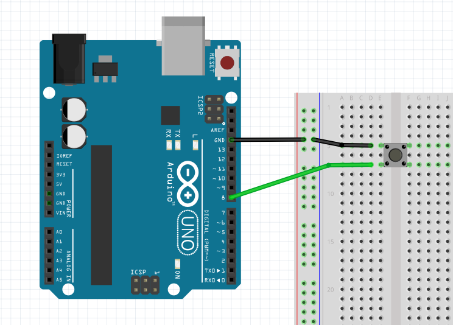

# Autpilot button example

The easiest setup to get you started is getting a pushbutton to interact with MFS2020. In this example, we'll explain everything you need to create your first project.

## What you’ll need

- A microcontroller (Arduino, ESP, Teensy, etc.).
- A pushbutton.
- 2 Wires (preferably 1 black and 1 colored).
- A breadboard

> Other components will work as well so feel free to experiment to your hearts desire

## Wiring the components

There are multiple ways to connect the pushbutton to a microcontroller. We’ll teach you the easiest way, which utilizes the microcontroller's built-in pullup resistors.

First place the pushbutton in the middle of the breadboard so it bridges the gap in the middle. Now connect one of the wires to the ground connection on your controller and the other end to the top leg of the button (see the image below). The next step will be to connect the other leg of the button to pin 8 on your controller (you can change the pin as long as you alter the code as well).



## Writing the firmware

In order to actually make the controller actually interact with the button we need to write a small bit of code. Don’t forget to make any changes if you’ve decided to connect the button to another pin.

```cpp
{{#include ./btn_ap_master.ino}}
```
